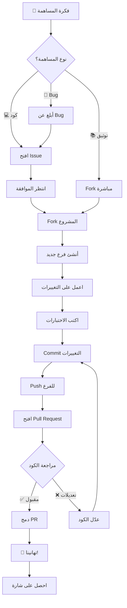

<div align="center">


[](/)
[](/)
[](/)
[](LICENSE.md)

</div>

---

## 🎯 مقدمة | Introduction

<div align="center">

> **"المساهمة ليست مجرد كود... إنها بناء مجتمع!"** 🌟

**شكراً لاهتمامك بالمساهمة في مشروع Nuclear Dome! 💚**

نحن نرحب بكل المساهمات من الجميع - **مبتدئين ومحترفين!** 🎉

</div>

```yaml
💡 ما يمكنك المساهمة به:
  - 💻 كود برمجي
  - 📚 توثيق
  - 🎨 تصميم
  - 🐛 إبلاغ عن bugs
  - 💡 أفكار وميزات
  - 🌍 ترجمة
  - 🎓 دروس وأمثلة
  - 🔍 مراجعة الكود
```

---

## 📋 جدول المحتويات | Table of Contents

<details open>
<summary><b>🗂️ اضغط للتوسع | Click to Expand</b></summary>

- [⚡ البداية السريعة](#-البداية-السريعة--quick-start)
- [🎯 أنواع المساهمات](#-أنواع-المساهمات--types-of-contributions)
- [🚀 عملية المساهمة](#-عملية-المساهمة--contribution-process)
- [📝 معايير الكود](#-معايير-الكود--code-standards)
- [🔍 عملية المراجعة](#-عملية-المراجعة--review-process)
- [🏆 نظام المكافآت](#-نظام-المكافآت--rewards-system)
- [📞 التواصل والدعم](#-التواصل-والدعم--contact--support)

</details>

---

## ⚡ البداية السريعة | Quick Start

<div align="center">

### 🚀 ابدأ المساهمة في 5 دقائق!

</div>

```bash
# 1️⃣ Fork المشروع
# اضغط على زر "Fork" في أعلى الصفحة

# 2️⃣ استنسخ المشروع
git clone https://github.com/YOUR_USERNAME/nuclear-dome-readme.git
cd nuclear-dome-readme

# 3️⃣ أنشئ فرع جديد
git checkout -b feature/amazing-feature
# أو
git checkout -b fix/bug-name
# أو
git checkout -b docs/update-readme

# 4️⃣ قم بالتغييرات
# اعمل سحرك هنا! ✨

# 5️⃣ Commit التغييرات
git add .
git commit -m "feat: add amazing feature"

# 6️⃣ Push للفرع
git push origin feature/amazing-feature

# 7️⃣ افتح Pull Request
# اذهب لصفحة GitHub وافتح PR
```

<div align="center">


</div>

---

## 🎯 أنواع المساهمات | Types of Contributions

<div align="center">

### 💎 نرحب بكل أنواع المساهمات!

</div>

### 1️⃣ 💻 المساهمات البرمجية | Code Contributions

<table>
<tr>
<td width="50%">

#### 🐛 إصلاح Bugs
```yaml
الأولوية: عالية 🔴
الصعوبة: متنوعة
المكافأة: 🎖️ Bug Hunter Badge

الخطوات:
1. ابحث عن bug في Issues
2. علّق "أريد العمل على هذا"
3. أصلح المشكلة
4. اكتب اختبارات
5. افتح PR
```

[](/)

</td>
<td width="50%">

#### ✨ ميزات جديدة
```yaml
الأولوية: متوسطة 🟡
الصعوبة: متوسطة-عالية
المكافأة: 🏆 Feature Creator Badge

الخطوات:
1. اقترح الميزة في Issues
2. انتظر الموافقة
3. ناقش التصميم
4. نفذ الميزة
5. افتح PR
```

[](/)

</td>
</tr>
<tr>
<td width="50%">

#### ⚡ تحسين الأداء
```yaml
الأولوية: عالية 🔴
الصعوبة: عالية
المكافأة: 🚀 Performance Star

الخطوات:
1. حدد نقطة البطء
2. قِس الأداء الحالي
3. نفذ التحسينات
4. قِس الأداء الجديد
5. اثبت التحسن
```

[](/)

</td>
<td width="50%">

#### 🔐 تحسينات الأمان
```yaml
الأولوية: حرجة 🔴
الصعوبة: عالية
المكافأة: 🛡️ Security Hero

الخطوات:
1. حدد الثغرة
2. أبلغ بشكل خاص أولاً!
3. انتظر الموافقة
4. نفذ الإصلاح
5. افتح PR
```

[](/)

</td>
</tr>
</table>

---

### 2️⃣ 📚 المساهمات التوثيقية | Documentation Contributions

<table>
<tr>
<td width="50%">

#### 📖 تحديث التوثيق
- تحسين README
- إضافة أمثلة
- توضيح API
- شرح الميزات

[](/)

</td>
<td width="50%">

#### 🌍 الترجمة
- ترجمة للعربية
- ترجمة للإنجليزية
- لغات أخرى

[](/)

</td>
</tr>
<tr>
<td width="50%">

#### 🎓 دروس وأمثلة
- كتابة دروس
- إضافة أمثلة
- شرح Use Cases

[](/)

</td>
<td width="50%">

#### ✏️ تصحيح لغوي
- إصلاح أخطاء إملائية
- تحسين الصياغة
- توحيد المصطلحات

[](/)

</td>
</tr>
</table>

---

### 3️⃣ 🎨 المساهمات التصميمية | Design Contributions

```yaml
🎨 ما يمكنك تصميمه:
  - Logos & Icons
  - Banners & Headers
  - UI/UX Mockups
  - Infographics
  - Color Schemes
  - Typography
```

[](/)

---

### 4️⃣ 🐛 الإبلاغ عن Bugs | Bug Reports

<details>
<summary><b>📝 نموذج الإبلاغ عن Bug</b></summary>

```markdown
## 🐛 وصف المشكلة
[وصف واضح ومختصر للمشكلة]

## 🔄 خطوات إعادة الإنتاج
1. اذهب إلى '...'
2. اضغط على '...'
3. انزل إلى '...'
4. شاهد الخطأ

## ✅ السلوك المتوقع
[ما كان يجب أن يحدث]

## ❌ السلوك الفعلي
[ما حدث بالفعل]

## 📸 لقطات الشاشة
[إن أمكن]

## 💻 البيئة
- OS: [e.g. Windows 11, macOS 14]
- Browser: [e.g. Chrome 120, Firefox 121]
- Version: [e.g. v1.0.0]

## 📝 معلومات إضافية
[أي معلومات أخرى]
```

</details>

[](https://github.com/nuclear-dome/readme/issues/new?template=bug_report.md)

---

### 5️⃣ 💡 اقتراح ميزات | Feature Requests

<details>
<summary><b>✨ نموذج اقتراح الميزة</b></summary>

```markdown
## 💡 وصف الميزة
[وصف واضح للميزة المقترحة]

## 🎯 المشكلة التي تحلها
[ما المشكلة الحالية؟]

## 🔧 الحل المقترح
[كيف ستعمل الميزة؟]

## 🌟 البدائل
[هل فكرت في حلول أخرى؟]

## 📊 الأولوية
- [ ] حرجة
- [ ] عالية
- [ ] متوسطة
- [ ] منخفضة

## 🎨 Mockups
[تصاميم أو رسومات إن أمكن]
```

</details>

[](https://github.com/nuclear-dome/readme/issues/new?template=feature_request.md)

---

## 🚀 عملية المساهمة | Contribution Process

<div align="center">

### 📊 خارطة الطريق الكاملة

</div>



---

### 📋 خطوات تفصيلية | Detailed Steps

<details>
<summary><b>1️⃣ Fork المشروع</b></summary>

```bash
# اذهب لصفحة المشروع على GitHub
# اضغط على زر "Fork" في الأعلى
# سيتم إنشاء نسخة في حسابك
```


</details>

<details>
<summary><b>2️⃣ استنسخ المشروع</b></summary>

```bash
# استنسخ من الـ fork الخاص بك
git clone https://github.com/YOUR_USERNAME/nuclear-dome-readme.git

# ادخل للمجلد
cd nuclear-dome-readme

# أضف الـ upstream
git remote add upstream https://github.com/nuclear-dome/readme.git
```


</details>

<details>
<summary><b>3️⃣ أنشئ فرع جديد</b></summary>

```bash
# تأكد أنك على main
git checkout main

# حدّث من upstream
git pull upstream main

# أنشئ فرع جديد
git checkout -b feature/amazing-feature

# أنواع الفروع:
# feature/  - للميزات الجديدة
# fix/      - لإصلاح bugs
# docs/     - للتوثيق
# style/    - للتنسيق
# refactor/ - لإعادة الهيكلة
# test/     - للاختبارات
```


</details>

<details>
<summary><b>4️⃣ اعمل على التغييرات</b></summary>

```javascript
// اكتب كودك الرائع! ✨

// مثال:
function amazingFeature() {
  // كود نظيف ومنظم
  console.log('🎉 ميزة رائعة!');
}

// تذكر:
// - اتبع معايير الكود
// - اكتب تعليقات واضحة
// - اجعله بسيط وقابل للقراءة
```


</details>

<details>
<summary><b>5️⃣ اختبر التغييرات</b></summary>

```bash
# شغّل الاختبارات
npm test

# تأكد من النجاح
# ✅ All tests passed!

# اختبر يدوياً
npm run dev
```


</details>

<details>
<summary><b>6️⃣ Commit التغييرات</b></summary>

```bash
# أضف الملفات
git add .

# Commit مع رسالة واضحة
git commit -m "feat: add amazing feature

- إضافة ميزة X
- تحسين وظيفة Y
- إصلاح مشكلة Z

Closes #123"

# استخدم Conventional Commits:
# feat:     ميزة جديدة
# fix:      إصلاح bug
# docs:     تحديث توثيق
# style:    تنسيق الكود
# refactor: إعادة هيكلة
# test:     إضافة اختبارات
# chore:    مهام صيانة
```


</details>

<details>
<summary><b>7️⃣ Push للفرع</b></summary>

```bash
# ارفع التغييرات
git push origin feature/amazing-feature

# إذا كانت أول مرة:
git push -u origin feature/amazing-feature
```


</details>

<details>
<summary><b>8️⃣ افتح Pull Request</b></summary>

```markdown
## 🎯 الوصف
[وصف واضح للتغييرات]

## 📋 نوع التغيير
- [ ] 🐛 إصلاح bug
- [ ] ✨ ميزة جديدة
- [ ] 📚 تحديث توثيق
- [ ] ⚡ تحسين أداء
- [ ] 🔐 تحسين أمان

## ✅ Checklist
- [ ] اتبعت معايير الكود
- [ ] كتبت/حدّثت الاختبارات
- [ ] حدّثت التوثيق
- [ ] كل الاختبارات تعمل
- [ ] الكود نظيف ومنظم

## 📸 لقطات الشاشة
[إن أمكن]

## 🔗 مرتبط بـ
Closes #123
```


</details>

---

## 📝 معايير الكود | Code Standards

<div align="center">

### ✨ اكتب كود نظيف وجميل!

</div>

### 🎯 القواعد الأساسية | Basic Rules

```yaml
1️⃣ الوضوح أولاً:
  - اسماء متغيرات واضحة
  - وظائف صغيرة ومحددة
  - تعليقات مفيدة

2️⃣ البساطة قوة:
  - لا تعقد الأمور
  - استخدم أبسط حل
  - قابل للقراءة

3️⃣ الاتساق:
  - نفس أسلوب الكود
  - نفس التنسيق
  - نفس الأنماط

4️⃣ الأداء:
  - كود فعال
  - تجنب التكرار
  - استخدم البنى المناسبة
```

---

### 💻 أمثلة على الكود الجيد

<table>
<tr>
<td width="50%">

#### ❌ كود سيء
```javascript
// اسم غير واضح
const x = getData();

// وظيفة طويلة ومعقدة
function process(d) {
  // 100 سطر من الكود...
}

// بدون تعليقات
if (a && b || c) {
  // ماذا يحدث هنا؟
}
```

</td>
<td width="50%">

#### ✅ كود جيد
```javascript
// اسم واضح
const userData = getUserData();

// وظائف صغيرة ومحددة
function validateUser(user) {
  return user.isValid();
}

// تعليق مفيد
// التحقق من صلاحية المستخدم
if (isUserValid && hasPermission) {
  grantAccess();
}
```

</td>
</tr>
</table>

---

### 🎨 معايير التنسيق | Formatting Standards

```javascript
// ✅ استخدم 2 مسافات للـ indentation
function example() {
  if (condition) {
    doSomething();
  }
}

// ✅ فراغات حول العوامل
const sum = a + b;
const result = (x * y) / z;

// ✅ أسطر فارغة للتنظيم
function first() {
  // code
}

function second() {
  // code
}

// ✅ أقواس مجعدة على نفس السطر
if (condition) {
  // code
} else {
  // code
}

// ✅ فاصلة منقوطة في النهاية
const name = 'Nike';
doSomething();
```

---

## 🔍 عملية المراجعة | Review Process

<div align="center">

### 👀 كيف نراجع Pull Requests

</div>

```yaml
🔍 معايير المراجعة:

1️⃣ الوظيفة:
  - هل يعمل الكود؟
  - هل يحل المشكلة؟
  - هل الاختبارات تعمل؟

2️⃣ الجودة:
  - هل الكود نظيف؟
  - هل يتبع المعايير؟
  - هل التوثيق كافٍ؟

3️⃣ الأمان:
  - هل هناك ثغرات؟
  - هل البيانات محمية؟
  - هل يتبع best practices؟

4️⃣ الأداء:
  - هل فعال؟
  - هل مُحسّن؟
  - هل يؤثر على السرعة؟
```

### ⏱️ الوقت المتوقع

| نوع PR | الوقت |
|:---:|:---:|
| 🐛 Bug Fix | 1-2 أيام |
| 📚 Docs | 1 يوم |
| ✨ Feature | 3-5 أيام |
| 🔐 Security | فوري |

---

## 🏆 نظام المكافآت | Rewards System

<div align="center">

### 🎖️ احصل على شارات رائعة!

</div>

<table>
<tr>
<td align="center" width="20%">


**أول PR**

</td>
<td align="center" width="20%">


**5+ Bugs**

</td>
<td align="center" width="20%">


**3+ Features**

</td>
<td align="center" width="20%">


**10+ Docs**

</td>
<td align="center" width="20%">


**50+ PRs**

</td>
</tr>
</table>

### 🎁 المكافآت الإضافية

```yaml
💎 عند 10 PRs:
  - شارة Contributor
  - ذكر في README
  - شكر خاص

💎 عند 25 PRs:
  - شارة Active Contributor
  - دعوة لـ Discord VIP
  - أولوية في المراجعة

💎 عند 50 PRs:
  - شارة Super Contributor
  - عضوية Core Team
  - وصول مبكر للميزات

💎 عند 100 PRs:
  - شارة Legend
  - مشروع مخصص باسمك
  - جائزة خاصة 🎁
```

---

## 📞 التواصل والدعم | Contact & Support

<div align="center">

### 💬 نحن هنا لمساعدتك!

</div>

<table>
<tr>
<td width="50%">

### 💌 البريد الإلكتروني
```
📧 للأسئلة العامة:
nike49424@gmail.com

📧 للمسائل الأمنية:
nike49424@proton.me
```

[](mailto:nike49424@gmail.com)

</td>
<td width="50%">

### 💬 Discord
```
💬 انضم لسيرفرنا:
discord.gg/nuclear-dome

🎯 قنوات متاحة:
- #general
- #help
- #contributions
- #showcase
```

[](/)

</td>
</tr>
<tr>
<td width="50%">

### 🐦 Twitter
```
🐦 تابعنا:
@nike49424

📢 نشارك:
- تحديثات
- نصائح
- إنجازات
```

[](/)

</td>
<td width="50%">

### 💬 GitHub Discussions
```
💡 شارك أفكارك:
github.com/nuclear-dome/readme/discussions

🗣️ ناقش:
- أفكار
- أسئلة
- اقتراحات
```

[](/)

</td>
</tr>
</table>

---

## 📚 موارد مفيدة | Useful Resources

<div align="center">

### 🎓 تعلم المزيد!

</div>

```yaml
📖 التوثيق:
  - README.md - نظرة عامة
  - LICENSE.md - الترخيص
  - CODE_OF_CONDUCT.md - ميثاق السلوك
  - SECURITY.md - الأمان

🎬 فيديوهات:
  - كيف تساهم في GitHub
  - دليل Git للمبتدئين
  - أفضل ممارسات الكود

📝 مقالات:
  - How to Write Good Commits
  - Clean Code Principles
  - Git Workflow Guide
```

---

## 🙏 شكر خاص | Special Thanks

<div align="center">

### 💚 شكراً لكل المساهمين!

<a href="https://github.com/nuclear-dome/readme/graphs/contributors">
  
</a>

---

### 🌟 Top Contributors

<table>
  <tr>
    <td align="center">
      
      <br />
